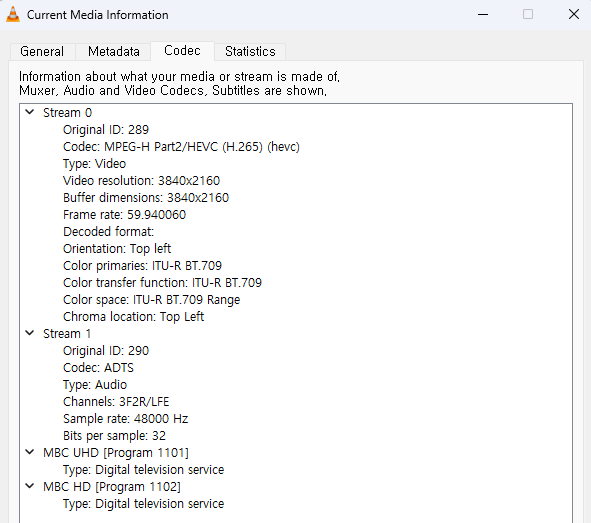

# danttoUHD
**danttoUHD**는 한국 지상파 UHD 방송(ATSC 3.0)을 MPEG-2 TS로 변환하는 툴입니다.
현재 ROUTE 방식만 지원하며, MMT 방식(KBS1 등)은 지원되지 않습니다.

## 주요 특징
1. MPEG-H 3D Audio → AAC 인코딩 지원
2. 다중 서비스 지원



## 사용 방법
```
./danttoUHD.exe <input> <output.ts>
options:
	--casServerUrl=<url>
```
LG 지상파 UHD 셋탑박스 AN-US800K의 자체 컨테이너 형식만 지원하며, 다른 포맷은 지원하지 않습니다.
***
아래 명령어로 셋탑박스에서 방송을 덤프할 수 있습니다.
```
dd if=/proc/lg/atsc3/dump/reader of=/tmp/usb/sda/sda1/dump bs=1024
```
## CAS
이 프로젝트는 복호화 기능이 포함되어 있지만, 복호화 키를 추출하는 기능은 포함되어 있지 않습니다.
따라서 암호화되지 않은 지역 방송(TJB, KNN 등)에만 사용할 수 있습니다.

## TODO
- MMT 지원
- EPG 변환
